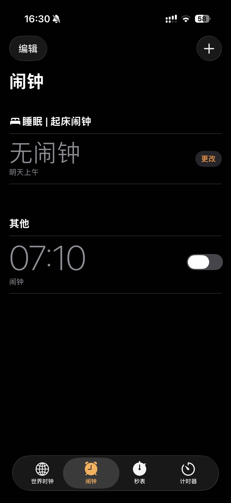
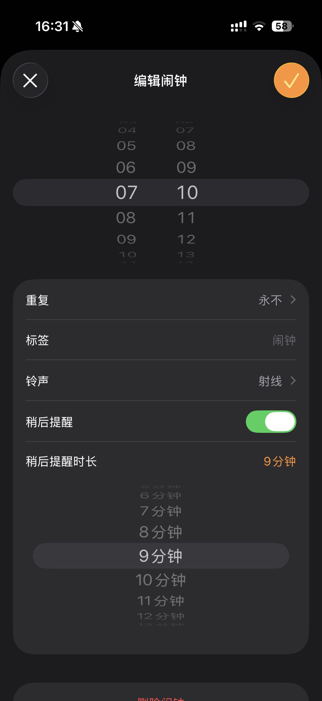
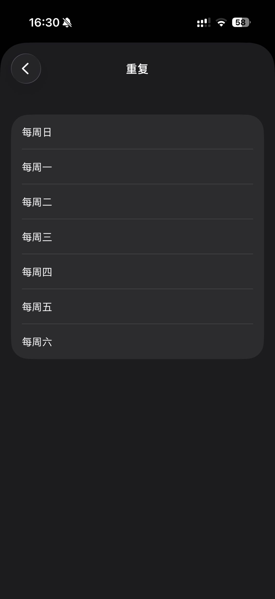
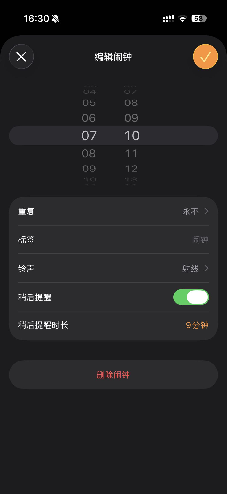
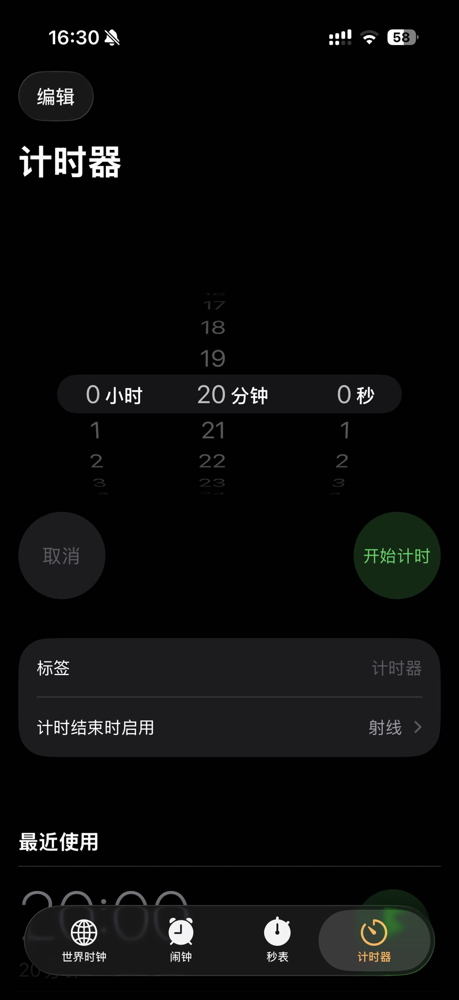
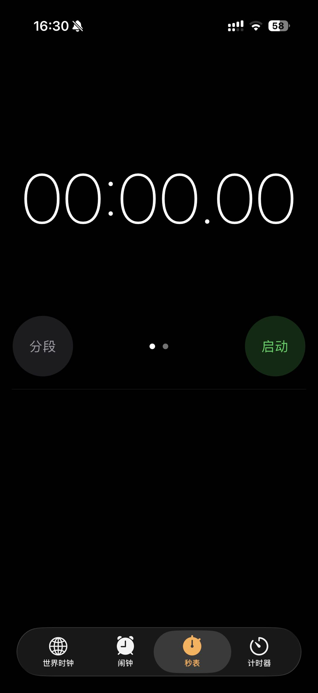
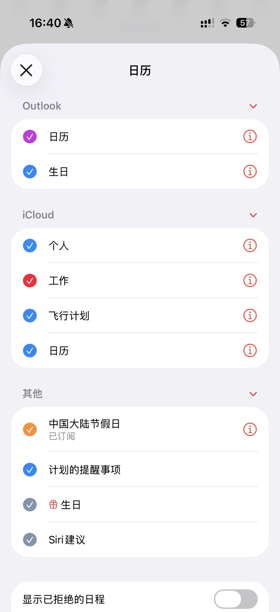

# Alarm 闹钟 App 需求文档

> 版本：V2.2-draft  
> 日期：2026-04-05  
> 负责人：薛

---

## 一、项目概述

### 1.1 产品定位

**产品名称**：Alarm（暂定）  
**产品类型**：工具类 App（iOS 专属）  
**最低系统版本**：iOS 26.0+  
**核心定位**：使用 iOS 原生 AlarmKit 框架开发，完全复刻 iPhone 闹钟的 UI 与交互体验，同时修复 iOS 闹钟长期存在的功能缺陷——**跳过节假日**。

### 1.2 技术选型

| 技术栈 | 说明 |
|--------|------|
| **框架** | AlarmKit（iOS 26 新增） |
| **语言** | Swift 6 |
| **UI** | SwiftUI（用于 Widget Extension 和自定义展示） |
| **架构** | SwiftUI App + Widget Extension |
| **权限** | NSAlarmKitUsageDescription |
| **本地存储** | UserDefaults（小数据）/ SQLite（闹钟历史） |
| **节假日数据** | EventKit 读取系统日历订阅（中国大陆节假日） |

### 1.3 为什么要做这款 App？

iOS 原生闹钟有两个痛点困扰用户多年：

| 痛点 | iOS 现状 | 本 App 解决方案 |
|------|----------|----------------|
| 跳过节假日 | ❌ 完全不支持 | ✅ 支持法定节假日 + 自定义日期跳过 |
| 重复规则不灵活 | 无法按节假日自动调整 | ✅ 智能跳过（节假日/周末跳过，调休上班不跳过） |

---

## 二、AlarmKit 框架说明

### 2.1 AlarmKit vs 旧方案对比

| 对比项 | 旧方案（UNNotification） | AlarmKit |
|--------|---------------------------|----------|
| 系统闹钟应用显示 | ❌ 不显示 | ✅ 显示在时钟 App |
| 铃声体验 | 一般通知音 | ✅ 系统闹钟完整音效 |
| 锁屏控制 | 有限 | ✅ 完整停止/稍后/重复控制 |
| 重复逻辑 | 手动计算 | ✅ 原生支持按周重复 |

### 2.2 核心 API

```swift
// 权限请求
let status = try await AlarmManager.shared.requestAuthorization()

// 创建固定时间闹钟
let schedule = Alarm.Schedule.fixed(date)
let configuration = AlarmConfiguration.alarm(schedule: schedule, attributes: attributes)
try await AlarmManager.shared.schedule(id: id, configuration: configuration)

// 停止闹钟
try AlarmManager.shared.stop(id: alarmID)

// 暂停/恢复
try AlarmManager.shared.pause(id: alarmID)
try AlarmManager.shared.resume(id: alarmID)

// 自定义铃声
let sound = AlertConfiguration.AlertSound.named("Chime")
```

### 2.3 AppIntent 交互

通过 AppIntent 处理闹钟的停止、暂停、恢复、重复等操作：

```swift
struct StopIntent: LiveActivityIntent {
    @Parameter(title: "alarmID") var alarmID: String
    func perform() throws -> some IntentResult {
        try AlarmManager.shared.stop(id: UUID(uuidString: alarmID)!)
        return .result()
    }
}
```

---

## 三、功能需求

### 3.1 功能范围

#### ✅ 完整复刻 iOS 闹钟功能

| 模块 | 功能 | 状态 |
|------|------|------|
| **闹钟列表** | 显示所有闹钟 | ✅ |
| **新建闹钟** | 时间选择器 | ✅ |
| **重复** | 每天/工作日/自定义星期 | ✅ |
| **铃声** | 默认铃声 + 自定义铃声 | ✅ |
| **标签** | 闹钟备注文字 | ✅ |
| **就寝时间** | 睡眠分析（简化版） | ✅ |
| **自定义贪睡时长** | 用户可自定义稍后提醒时长（1-30分钟） | ✅ 新增 |
| **秒表** | 标准秒表 | ✅ |
| **计时器** | 倒计时 | ✅ |
| **响铃交互** | 停止/稍后提醒 | ✅ |

#### 🔥 新增功能（核心差异化）

| 模块 | 功能 | 状态 |
|------|------|------|
| **跳过节假日** | 法定节假日自动跳过 | ✅ 新增 |
| **周末跳过** | 周六日默认不响 | ✅ 新增 |
| **调休识别** | 自动识别串休补班日期 | ✅ 新增 |
| **自定义跳过日** | 用户手动添加跳过日期 | ✅ 新增 |

#### ❌ 不包含功能

| 功能 | 原因 |
|------|------|
| 世界时钟 | 用户明确不需要 |
| Bedtime 睡眠分析（完整版） | V2 再考虑 |
| Widget 复杂功能 | V2 再考虑 |

---

### 3.2 跳过节假日功能（核心）

#### 3.2.1 节假日数据源

```
数据来源：
1. 📅 EventKit 读取系统日历订阅（"中国大陆节假日"）
2. ✏️ 用户手动添加的自定义日期
```

**优势**：
- 无需维护离线数据库，跟随系统日历自动同步
- 用户可自行管理订阅的日历（如另添加其他地区节假日）
- iOS 日历已内置"中国大陆节假日"订阅，开箱即用

#### 3.2.2 节假日数据类型

| 类型 | 示例 | 处理方式 |
|------|------|----------|
| 法定节假日 | 春节、国庆节、清明节 | 跳过 |
| 周末 | 周六、周日 | 跳过 |
| 调休工作日 | 春节期间的补班周六日 | 不跳过（需正常工作） |
| 自定义假期 | 用户自定义 | 跳过 |
| 自定义工作日 | 用户自定义 | 不跳过 |

> 日历识别规则（中国大陆节假日日历）：
> - 日期标记含 `休`：按休息日处理（跳过）
> - 日期标记含 `班`：按上班日处理（不跳过）

#### 3.2.3 跳过逻辑

```
闹钟触发判断流程：
1. 获取闹钟设置的重复规则（如"工作日 07:30"）
2. 计算下一个触发日期
3. 检查该日期是否命中“工作日覆盖”（含 `班`、自定义工作日）
4. 若命中工作日覆盖 → 不跳过，正常响
5. 否则检查是否为节假日/周末/自定义跳过日
6. 若命中跳过规则 → 不响铃，继续计算下一日期
7. 更新闹钟的下一触发时间
```

---

## 四、UI / UX 设计规范

### 4.1 设计原则

1. **100% 复刻 iOS 16+ 原生闹钟 UI** — 保持用户熟悉感
2. **SwiftUI 构建** — 与 iOS 系统风格一致
3. **深色模式优先** — 现代 iOS 审美
4. **交互一致性** — 复用 iOS 经典动效

### 4.2 屏幕结构

```
┌─────────────────────────────────────┐
│           Alarm App                 │
├─────────────────────────────────────┤
│                                     │
│  Tab 1: 闹钟列表  ← 主Tab           │
│  Tab 2: 秒表                        │
│  Tab 3: 计时器                       │
│                                     │
└─────────────────────────────────────┘
```

**不包含**：世界时钟 Tab（已移除）

### 4.3 页面详情

#### 4.3.1 闹钟列表页

```
┌─────────────────────────────────────┐
│  闹钟                    ⚙️ 设置    │
├─────────────────────────────────────┤
│                                     │
│  ☀️ 07:30                   [—] ON │
│  工作日 · 上班闹钟                   │
│  下次：周一 4月6日 · 节假日跳过 🟢   │  ← 新增状态提示
│                                     │
│  ─ ─ ─ ─ ─ ─ ─ ─ ─ ─ ─ ─ ─ ─ ─ ─  │
│                                     │
│  🌙 22:00                   [—] ON │
│  每天 · 睡前提醒                     │
│  下次：明天 · 节假日跳过 🟢          │
│                                     │
│  ─ ─ ─ ─ ─ ─ ─ ─ ─ ─ ─ ─ ─ ─ ─ ─  │
│                                     │
│  ➕ 添加闹钟                         │
│                                     │
├─────────────────────────────────────┤
│  ⏱️ 秒表          ⏳ 计时器          │
└─────────────────────────────────────┘
```

**新增 UI 元素**：
- 每条闹钟显示"节假日跳过 🟢/🔴"状态
- 设置页入口（右上角 ⚙️）

#### 4.3.2 新建/编辑闹钟页

```
┌─────────────────────────────────────┐
│  (○×)           编辑闹钟       (○✓)  │
├─────────────────────────────────────┤
│                                     │
│           ┌─────────┐               │
│           │ 07 : 30 │               │  ← iOS 时间滚轮
│           └─────────┘               │
│                                     │
│  ─────────────────────────────────  │
│                                     │
│  重复            工作日 >            │
│  ─────────────────────────────────  │
│  标签            上班闹钟 >           │
│  ─────────────────────────────────  │
│  铃声            雷达 >               │
│  ─────────────────────────────────  │
│  😴 稍后提醒       [开启]             │
│  ─────────────────────────────────  │
│  😴 稍后提醒时长   9分钟 >            │
│     (点击后展开滚轮 1~30分钟)         │
│  ─────────────────────────────────  │
│  ⭐ 跳过节假日     [开启]             │  ← 🔥 核心新增
│  ─────────────────────────────────  │
│                                     │
│  [      删除闹钟（红色）        ]      │
│                                     │
└─────────────────────────────────────┘
```

#### 4.3.3 跳过节假日配置页（新增）

```
┌─────────────────────────────────────┐
│  ← 闹钟            跳过节假日配置    │
├─────────────────────────────────────┤
│                                     │
│  法定节假日          [开启] 🟢        │
│  自动跳过法定节假日                  │
│  ─────────────────────────────────  │
│  调休工作日          [开启] 🟢        │
│  识别并响铃补班日                   │
│  ─────────────────────────────────  │
│  自定义日期                          │
│  ─────────────────────────────────  │
│  + 添加跳过日期                      │
│  ─────────────────────────────────  │
│  清明节     4月4日         [×]       │
│  清明假期   4月4-6日       [×]       │
│  ─────────────────────────────────  │
│                                     │
│  节假日数据更新：2026年节假日已同步   │
│                                     │
└─────────────────────────────────────┘
```

#### 4.3.4 响铃页面

```
┌─────────────────────────────────────┐
│                                     │
│              🔔 闹钟                 │
│                                     │
│            07 : 30                  │
│                                     │
│         周二 · 4月6日                │
│                                     │
│         「上班闹钟」                  │
│                                     │
│   ┌──────────┐  ┌──────────┐       │
│   │  稍后      │  │   停止    │       │
│   │  10分钟    │  │          │       │
│   └──────────┘  └──────────┘       │
│                                     │
│  🔊 ════════════════                │
│                                     │
└─────────────────────────────────────┘
```

---

## 五、项目结构

```
Alarm/
├── AlarmApp.swift                     # App 入口
├── ContentView.swift                  # TabView 主结构
├── Views/
│   ├── AlarmListView.swift           # 闹钟列表
│   ├── AlarmEditView.swift           # 新建/编辑闹钟
│   ├── HolidayConfigView.swift       # 节假日配置
│   ├── StopwatchView.swift           # 秒表
│   └── TimerView.swift               # 计时器
├── Models/
│   ├── Alarm.swift                   # 闹钟数据模型
│   ├── HolidayData.swift            # 节假日数据
│   └── AppSettings.swift            # 用户设置
├── Services/
│   ├── AlarmManager.swift            # AlarmKit 封装
│   ├── HolidayService.swift          # 节假日数据服务
│   └── NotificationService.swift     # 本地通知（备用）
├── Utilities/
│   └── DateExtensions.swift          # 日期工具
├── Resources/
│   ├── Assets.xcassets
│   ├── Sounds/                        # 自定义铃声
│   └── HolidayData/                   # 节假日数据库
└── AlarmWidget/
    ├── AlarmWidget.swift              # Widget Extension
    └── AlarmWidgetView.swift         # Widget UI
```

---

## 六、技术实现要点

### 6.1 Info.plist 配置

```xml
<key>NSAlarmKitUsageDescription</key>
<string>Alarm+ 需要创建闹钟来提醒你重要的事情</string>
```

### 6.2 节假日数据获取

**通过 EventKit 读取系统日历订阅**：

```swift
import EventKit

// 1. 请求日历读取权限
let eventStore = EKEventStore()
let status = EKEventStore.authorizationStatus(for: .event)

// 2. 读取"中国大陆节假日"日历中的事件
let calendars = eventStore.calendars(for: .event)
let holidayCalendar = calendars.first { $0.title == "中国大陆节假日" }

// 3. 获取指定日期范围内所有节假日事件
let startDate = Calendar.current.date(byAdding: .year, value: -1, to: Date())!
let endDate = Calendar.current.date(byAdding: .year, value: 2, to: Date())!
let predicate = eventStore.predicateForEvents(withStart: startDate, end: endDate, calendars: [holidayCalendar])
let holidays = eventStore.events(matching: predicate)
```

**权限说明**：需要在 Info.plist 中添加 `NSCalendarsUsageDescription`

**兜底方案**：若用户未订阅节假日日历，引导其前往系统日历设置开启

### 6.3 Widget Extension

闹钟响铃时的 UI 通过 Widget Extension 实现：
- 使用 SwiftUI 构建展示界面
- 通过 AppIntent 处理用户交互（停止/稍后）
- 支持 Lock Screen 和 Notification Center

---

## 七、开发里程碑

### Phase 1：基础搭建
- [ ] 项目初始化 + XcodeGen 配置
- [ ] AlarmKit 权限 + 基础闹钟 CRUD
- [ ] 闹钟列表页 UI
- [ ] 新建/编辑闹钟页 UI
- [ ] 响铃页面 UI + 交互

### Phase 2：核心功能
- [ ] 跳过节假日功能
- [ ] 法定节假日数据导入
- [ ] 周末默认跳过
- [ ] 自定义跳过日期
- [ ] 调休工作日识别

### Phase 3：完善功能
- [ ] 秒表功能
- [ ] 计时器功能
- [ ] 自定义铃声支持
- [ ] 设置页面

### Phase 4：优化
- [ ] 深色模式
- [ ] 动效优化
- [ ] iOS 26+ 适配与回归测试

---

## 八、上线计划

待定

**注意**：因使用 AlarmKit，上线时需要特殊审核说明（系统闹钟集成）。

---

## 九、附录

### 9.1 UI 参考资料

以下是 iPhone 原生闹钟的 UI 截图，作为设计复刻的参考基准：

#### 闹钟列表主界面


#### 编辑闹钟（自定义贪睡时长）


#### 重复设置


#### 编辑闹钟（完整版）


#### 计时器


#### 秒表


#### 日历节假日数据（参考）

> 注：iOS 日历中的"中国大陆节假日"，我们的闹钟 App 可以复用相同的节假日数据来源。

**UI 设计原则：**
- 深色模式（Dark Mode）优先
- 纯黑背景 `#000000`
- 功能区块深灰 `#1C1C1E`
- 强调色橙色 `#FF9500`
- iOS 原生滚轮样式时间选择器

### 9.2 技术参考

- [Wake up to the AlarmKit API - WWDC25](https://developer.apple.com/videos/play/wwdc2025/230/)
- [iOS终于可以自定义闹钟了 - FoolishTalk](https://www.foolishtalk.org/2025/08/24/iOS%E7%BB%88%E4%BA%8E%E5%8F%AF%E4%BB%A5%E8%87%AA%E5%AE%9A%E4%B9%89%E9%97%B9%E9%92%9F%E4%BA%86/)
- [AlarmKit 官方示例代码](https://docs-assets.developer.apple.com/published/c2045ce0bff8/SchedulingAnAlarmWithAlarmKit.zip)

### 9.3 API 汇总

| 操作 | API |
|------|-----|
| 权限请求 | `AlarmManager.shared.requestAuthorization()` |
| 创建闹钟 | `AlarmManager.shared.schedule(id:configuration:)` |
| 停止闹钟 | `AlarmManager.shared.stop(id:)` |
| 暂停闹钟 | `AlarmManager.shared.pause(id:)` |
| 恢复闹钟 | `AlarmManager.shared.resume(id:)` |
| 删除闹钟 | `AlarmManager.shared.delete(id:)` |
| 获取所有闹钟 | `AlarmManager.shared.alarms` |

### 9.4 待确认问题

- [ ] 数据是否需要 iCloud 同步？

---

## 十、需求澄清（V2.2 草案）

> 本节用于开发前锁定关键决策，避免实现过程中返工。以下条目为当前版本中存在歧义或冲突的点。

### 10.1 平台与版本边界

- [ ] 最低系统版本确认：`iOS 26.0+`（使用 AlarmKit，不做 iOS 16~25 兼容实现）
- [ ] UI 文案中的“复刻 iOS 16+ 风格”仅作为视觉参考，不代表支持 iOS 16+

### 10.2 功能范围边界

- [ ] “就寝时间（简化版）”是否继续放入 V1 范围（当前会显著增加复杂度）
- [ ] Widget 是否仅做“状态展示”，不做复杂交互与配置
- [ ] 秒表/计时器是否要求与系统时钟完全一致（包含圈数、后台恢复、精度误差上限）

### 10.3 节假日与调休规则

- [ ] 节假日来源优先级：`系统日历(EventKit) > 用户自定义覆盖`
- [ ] 若系统未订阅“中国大陆节假日”，默认行为：`不跳过`，并展示引导开启
- [x] 调休工作日判断：按日历 `班` 标记 + 用户自定义工作日覆盖
- [x] 周末默认跳过（周六/周日），但 `班` 标记周末不跳过
- [ ] 时区策略：以“设备当前时区”计算是否跳过（跨时区出差时实时生效）

### 10.4 数据与同步策略

- [ ] 本地存储方案：V1 采用 `UserDefaults + SQLite`，不引入 CoreData
- [ ] iCloud 同步策略：V1 不做云同步，V2 再评估 CloudKit
- [ ] 历史记录保留周期：默认永久保留（后续可在设置中增加自动清理）

### 10.5 交互与合规

- [ ] 复刻边界：保持 iOS 交互习惯，但不使用 Apple 私有资源与受限素材
- [ ] 上线文案：在审核说明中强调 AlarmKit 合法用途及“节假日跳过”差异化能力
